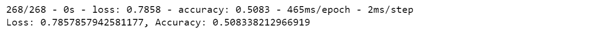
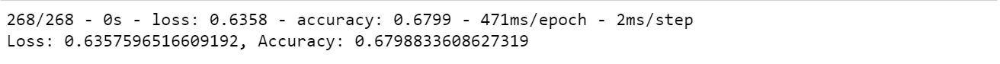
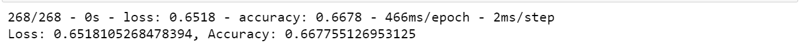
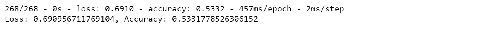

# Neural Network Charity Analysis

# Overview
The purpose of this project is to create a binary classifier that is capable of predicting whether applicants will be successful if funded by Alphabet Soup. Neural networks and deep learning models will be used.

# Resources
Data Source:
* charity_data.csv

Software:
* Python
* Jupyter notebook
* Pandas
* TensorFlow
* sklearn
  * StandardScaler
  * OneHotEncoder

# Results

## Data Preprocessing
1. The target of the model is the feature `IS_SUCCESSFUL` because it answers the purpose of the analysis (if the money was used effectively) and it contains a binary variable (Y/N).
2. The features of the model are: `EIN`, `NAME`, `APPLICATION_TYPE`, `AFFILIATION`, `CLASSIFICATION`, `USE_CASE`, `ORGANIZATION`, `STATUS`, `INCOME_AMT`,`SPECIAL_CONSIDERATIONS`, `ASK_AMT`
3. `EIN` and `NAME` have no value to the model and should be removed from the input data.

## Compiling, Training, and Evaluating the Model
### Initial Test 
*AlphatebetSoupCharity.ipynb*
1. Neural Network Configuration
   * 2 hidden layers (80, 30 neurons)
   * `relu` activation function in both hidden layers
   * 100 epochs
   * Removed noisy features - `EIN`, `NAME`

2. The model returned a __50%__ accuracy.

### Optimization Test 1 
*AlphatebetSoupCharity_Optimization.ipynb*
1. Neural Network Config
   * 2 hidden layers (80, 30 neurons)
   * `relu` activation function in both hidden layers
   * 200 epochs
   * Removed noisy features - `EIN`, `NAME`, `USE_CASE`, increased epochs to 200

2. The model returned a __68%__ accuracy.
   

3. Optimized: 3 noisy features were dropped; increased epochs to 200

### Optimization Test 2
*AlphatebetSoupCharity_Optimization.ipynb*
1. Neural Network Configuration
   * 3 hidden layers (100, 50, 25 neurons)
   * `relu` activation function used in all three hidden layers
   * 100 epochs
   * Removed noisy features - `EIN`, `NAME`, `USE_CASE` and increased neurons in each hidden layer

2. The model returned a __67%__ accuracy. 
   

3. Optimized: added a hidden layer; increased the neurons in each layer

### Optimization Test 3
*AlphatebetSoupCharity_Optimization.ipynb*
1. Neural Network Configuration
   * 2 hidden layers (80, 30 neurons)
   * `sigmoid` activation function in both hidden layers
   * 100 epochs
   * Removed noisy features - `EIN`, `NAME`, `USE_CASE`; changed activation funtion in hidden layers

2. The model returned a __53%__ accuracy.
   

3. Optimized: changed the activation functions in the hidden layer

# Neural Network Charity Analysis Summary
In summary, none of the models acheived the target accuracy of 75%. The closest model to the target was _Optimization Test 1_ with an accuracy rate of 68% and a loss rate of 64%. 

### Recommendation
1. Try a supervised machine learning model, such as Random Forest Classifier, since the dependent variable is binary.
2. use a data set that include better features to help define `IS_SUCCESSFUL`
